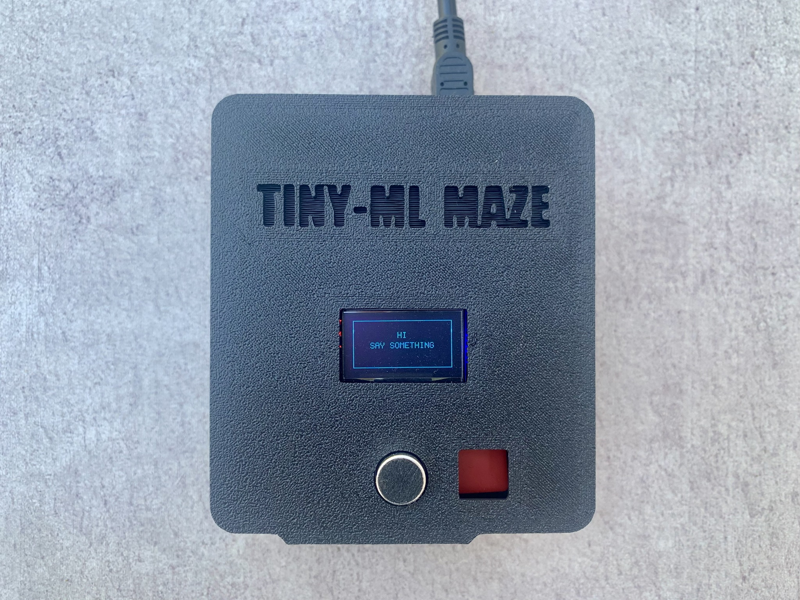
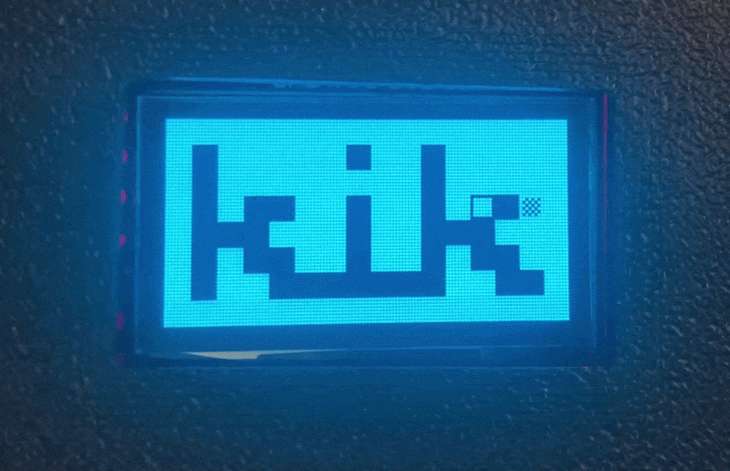
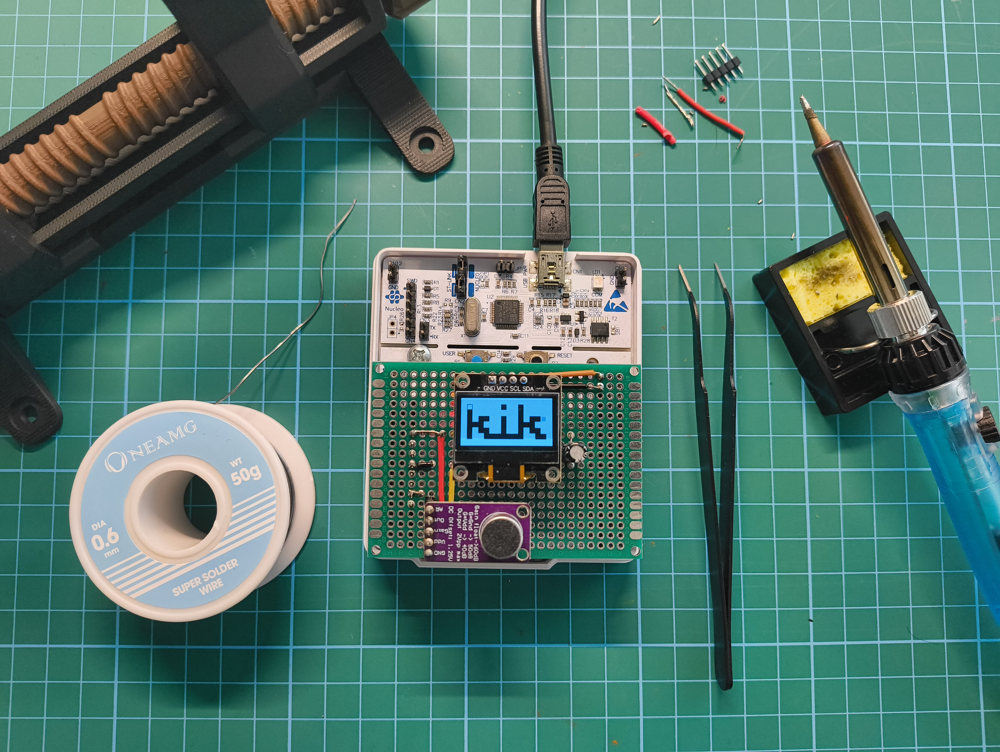

# TinyML Maze 🎙️🕹️

**Real-Time Voice Recognition and Edge AI on a Microcontroller**



TinyML Maze is a fully offline embedded system that allows users to navigate a digital maze using voice commands. Built on the heavily resource-constrained STM32F401RE, this project demonstrates the entire pipeline of deploying a Convolutional Neural Network (CNN) directly on edge hardware – from data collection to real-time inference.

## 🚀 Key Features

* **Always-On Voice Activity Detection (VAD):** Efficient amplitude monitoring using a moving average filter. Features a pre-roll ring buffer to capture the crucial first milliseconds of a spoken word, preventing data loss before the inference triggers.
* **On-Device Signal Processing:** Real-time calculation of 2D spectrograms from raw microphone data using Short-Time Fourier Transforms (STFT) via the CMSIS-DSP library.
* **Optimized Edge AI:** A custom-trained 5-class CNN (`up`, `down`, `left`, `right`, `random`). The model underwent Post-Training Quantization (PTQ) to INT8, drastically reducing its size to fit within the MCU's 96 KB of SRAM.
* **Interactive Game Engine:** A deterministic state machine written in C that translates AI predictions into player movements on a mapped OLED display.



## 🛠️ Hardware Requirements

* **Microcontroller:** STM32 Nucleo-F401RE (ARM Cortex-M4, 84 MHz, 512 KB Flash, 96 KB SRAM)
* **Microphone:** MAX9814 (Electret microphone with built-in Automatic Gain Control to normalize voice inputs)
* **Display:** 0.96" SSD1306 OLED (I2C)



## 💻 Software Stack & Toolchain

* **Machine Learning:** Python, TensorFlow / Keras (Google Colab)
* **Code Generation:** STM32CubeMX with the X-CUBE-AI expansion
* **Firmware Development:** C, PlatformIO (VS Code), CMSIS-DSP

## ⚙️ Build and Upload

This project is built and managed using PlatformIO.

```bash
pio run
pio run --target upload

```

## 👨‍💻 Author

**Silas Löffler**, assisted by GitHub Copilot.
*First-Year Project - Artificial Intelligence and Cognitive Systems (B.Sc.) @ Hochschule Ansbach*