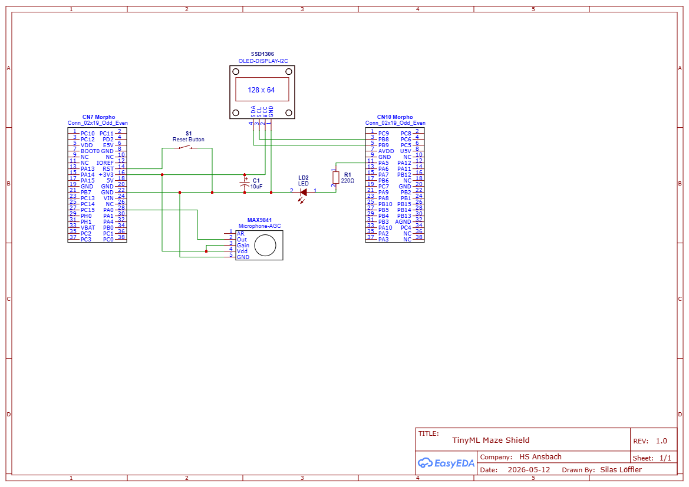
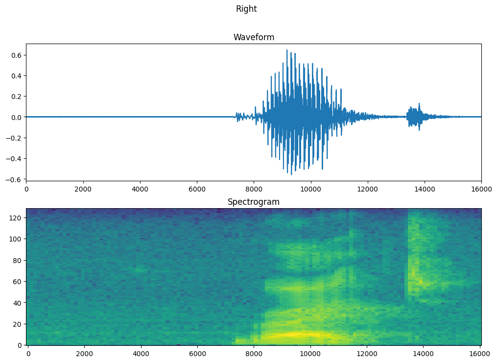
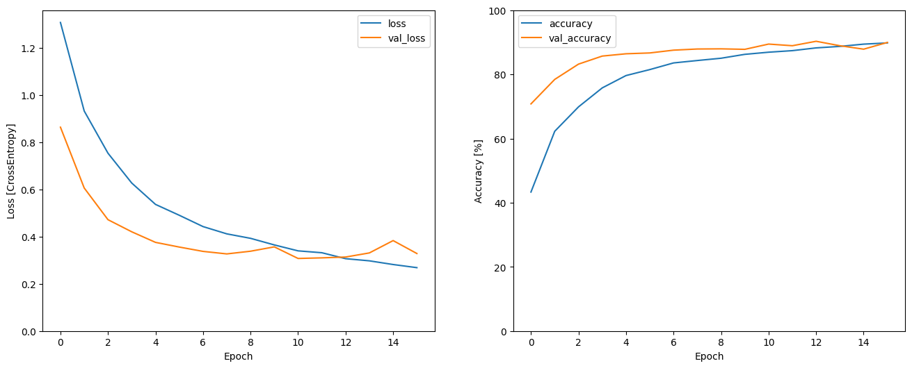

# TinyML Maze 🎙️🕹️

**Real-Time Voice Recognition and Edge AI on a Microcontroller**


TinyML Maze is a fully offline embedded system that lets users navigate a digital maze using voice commands. Built on the resource-constrained STM32F401RE, this project demonstrates the full pipeline of deploying a convolutional neural network (CNN) directly on edge hardware, from data collection to real-time inference.

The focus is practical: reliable keyword spotting, deterministic gameplay, and a toolchain that makes it easy to iterate from Python notebooks to flashing firmware on real hardware.

## 🚀 Key Features

* **Always-On Voice Activity Detection (VAD):** Efficient amplitude monitoring using a moving average filter, plus a pre-roll ring buffer to capture the crucial first milliseconds of a spoken word.
* **On-Device Signal Processing:** Real-time calculation of 2D spectrograms from raw microphone data using short-time Fourier transforms (STFT) via the CMSIS-DSP library.
* **Optimized Edge AI:** A custom-trained 5-class CNN (`up`, `down`, `left`, `right`, `random`) with post-training quantization (INT8), reducing the model size to fit within 96 KB of SRAM.
* **Interactive Game Engine:** A deterministic state machine in C that translates AI predictions into player movements on an OLED display.


Voice commands are processed entirely on-device: the microphone stream is preprocessed into spectrograms, the CNN predicts a direction, and the game state updates immediately on the OLED.

## 🛠️ Hardware Requirements

* **Microcontroller:** STM32 Nucleo-F401RE (ARM Cortex-M4, 84 MHz, 512 KB Flash, 96 KB SRAM)
* **Microphone:** MAX9814 (electret microphone with built-in automatic gain control)
* **Display:** 0.96" SSD1306 OLED (I2C)


All components are inexpensive and breadboard-friendly, so the system can be reproduced without custom PCBs.

## 🧭 Schematics

The schematic is stored in the `assets` folder. It shows the Nucleo-F401RE (Morpho header) wiring to the MAX9814 (MIC), SSD1306 (I2C), and the onboard LED `LD2`.



Note: The modules are typically powered from 3.3V. Check breakout labels (`VCC` vs `VIN`) - if `VIN` is present and a regulator is onboard, 5V on `VIN` may be possible.

## 💻 Software Stack & Toolchain

* **Machine Learning:** Python, TensorFlow/Keras (Google Colab)
  - Data collection with the `mini_speech_commands` structure, cleanup, and augmentation in Python notebooks.
  - Training in Keras with validation callbacks; export the best model as SavedModel.
  - Post-training quantization (INT8) with the TensorFlow Lite converter.
* **Code Generation & Integration:** STM32CubeMX + X-CUBE-AI
  - Generate C code from the quantized TFLite model (X-CUBE-AI) and integrate `network.c`/`network_wrapper.c`.
* **Firmware Development & DSP:** C, PlatformIO (VS Code), CMSIS-DSP
  - Real-time preprocessing: ADC samples -> STFT -> 2D spectrogram (CMSIS-DSP).
  - Inference with the generated AI runtime, post-processing, and UI update on SSD1306.

Visual pipeline (high-level):

1. Data collection (wav) -> 2. Preprocessing and augmentation -> 3. Train CNN (Keras) -> 4. Quantize to TFLite INT8 -> 5. X-CUBE-AI codegen -> 6. Flash to Nucleo (PlatformIO)



## 📊 Training Results

The training curves show steady convergence with validation accuracy stabilizing around ~88-90% after the first few epochs, while loss continues to decrease without severe overfitting.



## ⚙️ Build and Upload

This project is built and managed using PlatformIO.

```bash
pio run
pio run --target upload
```

## 👨‍💻 Author

**Silas Löffler**, assisted by GitHub Copilot.
*First-Year Project - Artificial Intelligence and Cognitive Systems (B.Sc.) @ Hochschule Ansbach*